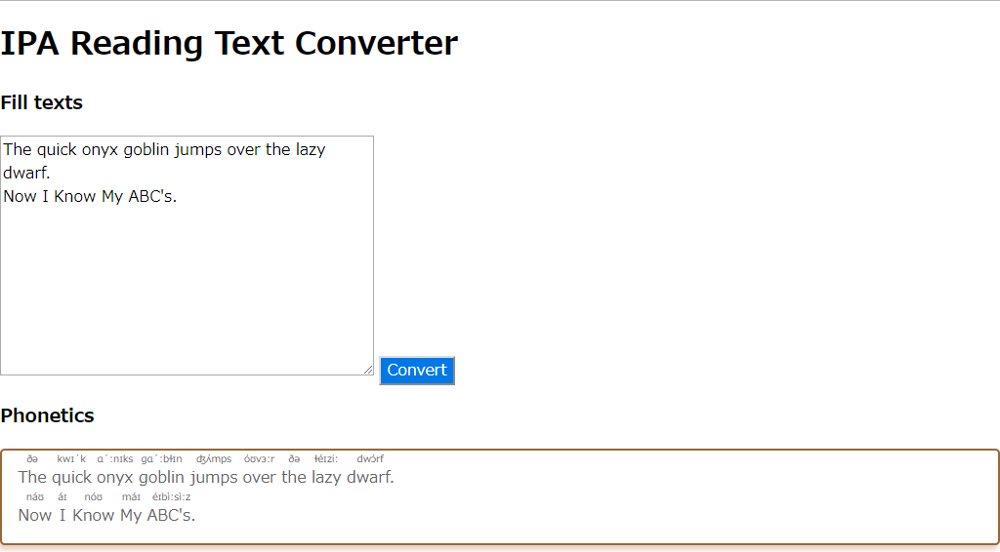

# Add \<ruby\> tags for language leaners

## Moan
The \<ruby\> tags are troublesome, aren't these?  

### Japanese
If we want to write 『<ruby>漢字<rp>(</rp><rt>かんじ</rt><rp>)</rp></ruby>を<ruby>読む<rp>(</rp><rt>よ　</rt><rp>)</rp></ruby>。』, we have to write the following code:
```
<ruby>漢字<rp>(</rp><rt>かんじ</rt><rp>)</rp></ruby>を<ruby>読む<rp>(</rp><rt>よ　</rt><rp>)</rp></ruby>。
```
If you want to write a long long sentence, How many tags do we need?  
And, how long does it take to do that?

Demo  


### English
When you want IPA, you try this.



## Dependency
- python 3.7+

## Usage
First of all, comment out the settings `config/setting.py` other than those you want to use.

e.g., You chose "development" mode
```python
# MODE = "production"
MODE = "development"
# MODE = "test"
```
This causes `app.py` to read the settings in the `config/development.yaml` file.  
Of course **you need to prepare the file with that name** in advance.  
`config/sample_setting.yaml` is prepared as a sample it.

To launch the app, enter the following command:
```bash
$ python app.py
```

This app is using the dictionary of MeCab with Janome.  
*Sometimes I notice mistakes in reading between tags*.  
Take care you use it.

## Licence
GPL v3

## Gratitude
[janome by mocobeta](https://github.com/mocobeta/janome)   
[cmudict](https://github.com/cmusphinx/cmudict)  
[Prism: syntax highlight and add a copy to clipboard button](https://prismjs.com/)